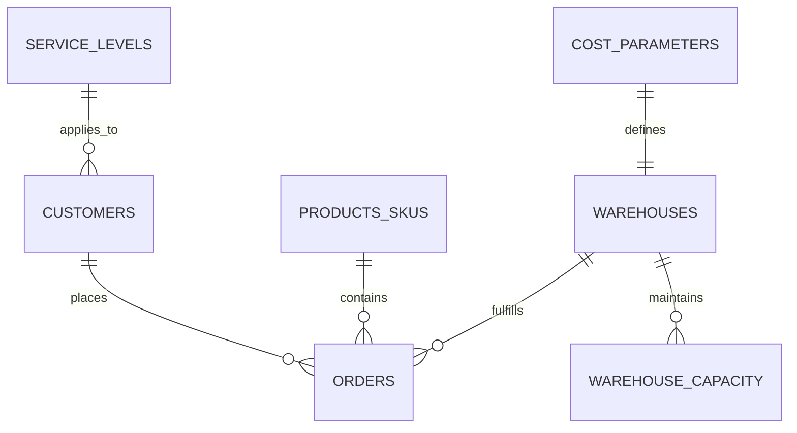

# FROM SOUTH KOREAN PROXY FREIGHT O/D TO ENTERPRISE PRODUCTION LOGISTICS NETWORK OPTIMIZATION ENGINE
## 한국 Proxy 화물 기종점(O/D) 데이터에서 기업용 Production 물류 네트워크 최적화 엔진으로의 전환

---

## EXECUTIVE SUMMARY / 요약

South Korea represents an exceptionally favorable environment for building logistics network optimization proxy engines due to its dense public data layers: provincial-level road freight O/D surveys provide interregional cargo flows in tons; a public warehouse registry details facility types, areas, locations, ownership, and handling categories; monthly parcel post statistics enable seasonality proxies; the Korea Transportation Database (KTDB) publishes interim freight O/D, truck O/D, and future-year forecasts; and administrative boundary GIS files allow mapping of flows and warehouses to geographic space. These resources are sufficient for constructing a structural trial engine to benchmark hub locations, demonstrate solver logic, and run scenario analyses prior to acquiring actual corporate operational data.

대한민국은 밀도 높은 공공 데이터 레이어 덕분에 물류 네트워크 최적화를 위한 대리(Proxy) 엔진을 구축하기에 매우 유리한 환경을 갖추고 있습니다. 시도 단위의 도로 화물 기종점(O/D) 조사는 지역 간 화물 물동량(톤) 흐름을 제공하며, 공공 물류창고 등록 제도는 창고의 유형, 면적, 위치, 운영 주체 및 취급 품목을 명시합니다. 또한, 월별 우편 배송 통계를 통해 계절성 대리 지표(Seasonality Proxy)를 도출할 수 있고, 국가교통데이터베이스(KTDB)는 화물 O/D, 트럭 O/D 및 미래 예측 물동량을 매년 업데이트하여 공표합니다. 이러한 자원은 실제 기업 데이터를 확보하기 전, 허브 위치의 벤치마크, 솔버 로직의 시연, 시나리오 분석을 수행할 수 있는 구조적 시험용 엔진을 구축하는 데 충분합니다.

But these public sources also reveal why a proxy engine cannot automatically function as a production engine. Public O/D is regional, aggregated, and based on annual tonnage; the warehouse registry is a static registration database rather than dynamic corporate operational records; and market reports indicate that tenant structures, absorption rates, vacancies, and logistics positioning vary widely by submarket and warehouse type. In network design literature, facility location decisions are intrinsically coupled with decisions regarding capacity, inventory, transport, service levels, uncertainty, and carbon footprint. A real-world decision-making engine must ingest order history, customer geography, SKU attributes, SLAs, operational capacities, carrier rate cards, on-hand inventory, and actual execution performance rather than general national patterns.

그러나 이러한 공공 데이터 소스는 Proxy 엔진이 자동으로 실운영(Production) 엔진으로 전환될 수 없는 이유도 동시에 명확히 보여줍니다. 공공 O/D는 지역별로 고도로 집계된 연간 톤수 기반 데이터이며, 창고 등록 데이터는 실제 기업의 동적 운영 기록이 아닌 정적인 등록 데이터베이스에 불과합니다. 또한, 시장 보고서에 따르면 임차인 구조, 흡수율, 공실률 및 물류 포지셔닝은 세부 시장(Submarket) 및 창고 유형에 따라 크게 다릅니다. 네트워크 설계 이론에서 설비 입지(Facility Location) 결정은 용량, 재고, 운송, 서비스 수준, 불확실성 및 탄소 배출에 대한 의사결정과 긴밀히 결합되어 있습니다. 따라서 실제 의사결정 엔진은 국가 전체의 평균적인 화물 흐름 패턴 대신 개별 기업의 주문 이력, 고객의 지리적 분포, SKU 속성, SLA, 운영 용량, 캐리어 요율표, 실제 재고 및 운송 실행 성과 데이터를 정밀하게 흡수해야 합니다.

The central conclusion of this research is that transitioning from proxy to production is primarily a transformation of data semantics and governance, followed by solver upgrades. A production engine requires a robust enterprise data schema, historical backtesting, API contracts, lineage tracking, observability, and human-in-the-loop approval workflows. The recommended approach is to preserve the proxy engine as a benchmark layer and progressively substitute proxy inputs with operational corporate data.

본 연구의 핵심 결론은 Proxy에서 Production으로의 전환이 단순히 솔버(Solver)를 업그레이드하는 문제가 아니라, 데이터 시맨틱(Semantics)과 거버넌스 체계를 근본적으로 변환하는 과정이라는 점입니다. 실운영 수준의 엔진은 고도화된 기업 데이터 스키마, 과거 데이터 기반 백테스팅, 명확한 API 계약, 리니지 추적, 관측 가능성 및 인간 승인 워크플로우(Human-in-the-loop)를 필요로 합니다. 올바른 접근 방향은 기존 Proxy 엔진을 벤치마킹 레이어(Benchmark Layer)로 보존하면서, 데이터 레이어를 실제 운영 데이터로 단계적으로 대체해 나가는 것입니다.

---

## 1. COMPARING PROXY AND PRODUCTION ENGINES
### 1. Proxy 엔진과 Production 엔진의 비교

| Dimension / 비교 차원 | Proxy Engine / Proxy 엔진 | Production Engine / Production 엔진 |
| :--- | :--- | :--- |
| **Primary Purpose / 주요 목적** | Validate network logic, benchmarking, demo, pre-sales, academic research. / 네트워크 로직 검증, 벤치마킹, 데모, 프리세일즈, 학술 연구 | Actual CAPEX/lease decisions, network planning, periodic operational planning. / 실제 CAPEX/임차 의사결정, 네트워크 기획, 정기적 운영 기획 |
| **Demand Granularity / 수요 세분성** | Regional, corridor-level annual flows. / 지역별, 노선별 연간 물동량 흐름 | Customer, ship-to location, SKU level, periodic (monthly/weekly). / 고객별, 배송지별, SKU 단위, 정기적 기간 단위 |
| **Candidate Facilities / 후보 시설** | Public warehouses, regional centroids, general warehouse clusters. / 공공 등록 창고, 지역 중심점, 일반 창고 군집 | Owned, leased, available 3PL sites, actual candidate sites. / 자사 소유, 임차, 사용 가능한 3PL 창고, 실제 후보지 |
| **Cost Modeling / 비용 모델링** | Proxy costs, weighted distance, generic benchmark rates. / Proxy 비용, 가중 거리, 일반적인 벤치마크 요율 | Actual rate cards, contract lane costs, handling, inventory holding, penalty costs. / 실제 요율표, 계약 노선 비용, 상하차/하역, 재고 보유, 패널티 비용 |
| **Capacity Constraints / 용량 제약 조건** | Area-based storage proxy. / 면적 기반의 단순 보관 용량 Proxy | Storage, throughput, dock, labor, and temperature-specific capacities. / 보관, 처리량, 도크(Dock), 노동력 및 온도 대역별 구체적 용량 |
| **Time Horizon / 시간적 가치** | Static, annual average. / 정적, 연간 평균 | Monthly/weekly profiles, dynamic re-optimization. / 월별/주별 프로필, 동적 재최적화 |
| **Validation / 검증 체계** | Geographic sanity checks. / 지리적 상식선 검증 (Sanity Check) | Backtesting, cost gap analysis, SLA gap analysis, utilization gap analysis. / 백테스팅, 비용 격차 분석, SLA 격차 분석, 가동률 격차 분석 |
| **Governance / 거버넌스** | Minimal, analysis-focused. / 가벼움, 분석 중심 | Versioning, audit trail, human approval, explainability, lineage monitoring. / 버전 관리, 감사 내역, 인간 승인 워크플로우, 설명 가능성, 리니지 모니터링 |
| **Business Value / 비즈니스 가치** | Insights and hypotheses. / 통찰력 및 가설 검증 | Responsible, high-stakes decision support. / 비즈니스 책임을 지는 의사결정 지원 |

---

## 2. DATA REPLACEMENT MAP
### 2. 데이터 대체 매핑 맵

To transition from a public-data proxy to an enterprise-grade production engine, each generic input must be mapped to its operational corporate equivalent:

공공 데이터 기반의 Proxy 엔진에서 기업용 Production 엔진으로 전환하기 위해서는 다음과 같이 각 입력 변수들을 실제 운영 데이터로 일대일 매핑하고 대체해야 합니다:

*   **Public Freight O/D Patterns $\rightarrow$ Historical Corporate Orders/Shipments**
    *   *Rationale:* Regional flows do not identify specific customer accounts, distribution channels, or promised delivery dates.
    *   *Minimum Required Fields:* `customer_id`, `ship_to_id`, `order_date`, `quantity`, `weight`, `volume_cube`, `service_class`
    *   *한국어 설명:* 지역 물동량 흐름은 구체적인 고객 계정, 유통 채널 또는 약속된 배송일을 반영하지 못함.
    *   *필수 최소 필드:* `customer_id`, `ship_to_id`, `order_date`, `quantity`, `weight`, `volume_cube`, `service_class`

*   **National Freight Demand by Region $\rightarrow$ Customer/SKU-Level Monthly Demand**
    *   *Rationale:* Production engines require granular demand profiles to allocate inventory and hub capacity accurately.
    *   *Minimum Required Fields:* `customer_id`, `region_id`, `sku_family`, `month_id`, `demand_qty`
    *   *한국어 설명:* 재고 및 허브 용량을 정확하게 할당하기 위해 세분화된 수요 프로필이 필요함.
    *   *필수 최소 필드:* `customer_id`, `region_id`, `sku_family`, `month_id`, `demand_qty`

*   **Public Warehouse Registry $\rightarrow$ Owned, Leased, and Available 3PL Sites**
    *   *Rationale:* Public registries do not indicate contractual access, lease constraints, or real-time space availability.
    *   *Minimum Required Fields:* `warehouse_id`, `ownership_type`, `active_flag`, `lease_end_date`, `address`, `latitude`, `longitude`
    *   *한국어 설명:* 공공 등록부는 계약상의 접근 권한, 임대 제약 조건 또는 실시간 공간 가용성을 나타내지 않음.
    *   *필수 최소 필드:* `warehouse_id`, `ownership_type`, `active_flag`, `lease_end_date`, `address`, `latitude`, `longitude`

*   **Area-Based Capacity Proxy $\rightarrow$ Actual Storage & Throughput Limits**
    *   *Rationale:* Physical floor area does not reflect operational throughput constraints, dock speeds, or labor capacities.
    *   *Minimum Required Fields:* `storage_capacity`, `throughput_capacity`, `dock_capacity`, `labor_shift_capacity`
    *   *한국어 설명:* 물리적 바닥 면적은 실제 처리 용량 제약, 도크 처리 속도 또는 노동력 용량을 반영하지 못함.
    *   *필수 최소 필드:* `storage_capacity`, `throughput_capacity`, `dock_capacity`, `labor_shift_capacity`

*   **Distance-Based Transport Cost Proxy $\rightarrow$ Carrier Rate Cards & Lane Tariffs**
    *   *Rationale:* True freight costs depend on specific carriers, zones, fuel surcharges, accessorials, and minimum charges.
    *   *Minimum Required Fields:* `origin_zone`, `destination_zone`, `service_level`, `carrier_id`, `rate_unit`, `minimum_charge`, `surcharge_formula`
    *   *한국어 설명:* 실제 운송 비용은 구체적인 운송업체, 지역 구분, 유류할증료, 기타 부대비용 및 최저 운임에 따라 달라짐.
    *   *필수 최소 필드:* `origin_zone`, `destination_zone`, `service_level`, `carrier_id`, `rate_unit`, `minimum_charge`, `surcharge_formula`

*   **Generic SLA Radius $\rightarrow$ Customer-Specific Service Level Agreements**
    *   *Rationale:* Broad geographic circles fail to model specific contractual delivery promises or strategic account requirements.
    *   *Minimum Required Fields:* `customer_id`, `promised_hours`, `cutoff_time`, `service_level_penalty`
    *   *한국어 설명:* 넓은 지리적 반경은 구체적인 계약상 배송 약속이나 전략적 핵심 고객 요구사항을 모델링하지 못함.
    *   *필수 최소 필드:* `customer_id`, `promised_hours`, `cutoff_time`, `service_level_penalty`

---

## 3. MINIMUM VIABLE PRODUCTION SCHEMA
### 3. 최소 실운영 데이터 스키마 (Minimum Viable Production Schema)

This schema represents the minimum data structure required to execute a serious, production-grade logistics optimization pilot. It acts as the "Data Contract" between the corporate database and the optimization engine.

이 스키마는 실운영 수준의 물류 최적화 파일럿 프로젝트를 시작하는 데 필요한 최소한의 데이터 구조를 나타냅니다. 이는 기업 내부 데이터베이스와 최적화 엔진 간의 "데이터 계약(Data Contract)" 역할을 수행합니다.

### Core Entities / 핵심 데이터 엔티티



#### 1. Customers Master (`customers`)
*   *Purpose:* Defines demand locations and service requirements.
*   *Fields:* `customer_id` (PK, str), `ship_to_id` (str), `customer_name` (str), `latitude` (float), `longitude` (float), `region_name` (str), `service_level_id` (FK, str), `active_flag` (bool)
*   *Data Quality Gate:* Non-null unique IDs, valid coordinates within geographic scope, active flags set correctly.

#### 2. Historical Orders (`orders`)
*   *Purpose:* Reconstructs historical demand profiles for optimization and backtesting.
*   *Fields:* `order_id` (PK, str), `customer_id` (FK, str), `order_date` (date), `sku_id` (FK, str), `quantity` (float), `weight_tons` (float), `volume_cbm` (float), `order_status` (str)
*   *Data Quality Gate:* Referential integrity with `customers` and `products_skus`, filter out canceled or returned orders.

#### 3. Products & SKUs (`products_skus`)
*   *Purpose:* Captures dimensions, weights, and handling constraints of products.
*   *Fields:* `sku_id` (PK, str), `product_family` (str), `handling_class` (str), `temperature_class` (str), `unit_weight` (float), `unit_volume` (float)
*   *Data Quality Gate:* Unique SKU IDs, standardized units (tons, meters, etc.).

#### 4. Warehouse Sites (`warehouses`)
*   *Purpose:* Identifies the candidate set of network nodes.
*   *Fields:* `warehouse_id` (PK, str), `warehouse_name` (str), `latitude` (float), `longitude` (float), `ownership_type` (str), `operating_status` (str)
*   *Data Quality Gate:* Unique site IDs, valid geocoding.

#### 5. Warehouse Capacity (`warehouse_capacity`)
*   *Purpose:* Enforces throughput and storage volume constraints.
*   *Fields:* `warehouse_id` (FK, str), `period_id` (str), `storage_capacity_pallet` (float), `throughput_capacity_ton` (float), `dock_door_count` (int)
*   *Data Quality Gate:* Non-negative capacities, temporal coverage matching the planning horizon.

#### 6. Transport Lane Master (`transport_lanes`)
*   *Purpose:* Establishes costs and lead times between candidate nodes and customers.
*   *Fields:* `origin_node` (str), `destination_node` (str), `distance_km` (float), `average_transit_time_hours` (float)
*   *Data Quality Gate:* Completeness of origin-destination combinations, realistic transit times based on routing networks.

#### 7. Service Levels (`service_levels`)
*   *Purpose:* Models promised lead times and penalty structures.
*   *Fields:* `service_level_id` (PK, str), `promised_delivery_hours` (float), `on_time_delivery_target_pct` (float), `violation_penalty_usd_per_hour` (float)
*   *Data Quality Gate:* Legitimate contractual parameters.

#### 8. Cost Parameters (`cost_parameters`)
*   *Purpose:* Standardizes the coefficients of the objective function.
*   *Fields:* `warehouse_id` (FK, str), `fixed_operating_cost_per_year` (float), `variable_handling_cost_per_ton` (float), `inventory_holding_cost_per_pallet_month` (float)
*   *Data Quality Gate:* Standardized currency and matching units.

#### 9. Optimization Scenarios (`optimization_scenarios`)
*   *Purpose:* Governs planning scenario limits and parameters.
*   *Fields:* `scenario_id` (PK, str), `max_open_hubs` (int), `budget_limit` (float), `demand_multiplier` (float), `fuel_surcharge_multiplier` (float)
*   *Data Quality Gate:* Reproducible settings.

#### 10. Assumptions Registry (`assumptions_registry`)
*   *Purpose:* Stores non-database policy decisions and model defaults.
*   *Fields:* `assumption_id` (PK, str), `parameter_name` (str), `parameter_value` (str), `unit` (str), `source_reference` (str), `owner` (str), `approval_status` (str)
*   *Data Quality Gate:* Versioned, officially approved.

---

## 4. MATHEMATICAL OPTIMIZATION MODEL FOR PRODUCTION
### 4. 실운영(Production) 최적화 수학적 모형

The mathematical model must shift from simple, single-commodity, unconstrained representations to a multi-period, multi-commodity, capacity-constrained formulations.

수학적 모형은 단순한 단일 품목 무제약 모형에서 벗어나, 다기간(Multi-period), 다품목(Multi-commodity), 용량 제약이 있는(Capacity-constrained) 수식으로 업그레이드되어야 실제 비즈니스 제약을 온전히 반영할 수 있습니다.

### Indices and Sets / 인덱스 및 세트
*   \(i \in I\): Customers / Demand nodes (고객 / 수요지 노드)
*   \(j \in J\): Candidate warehouses / Hubs (후보 물류창고 / 허브 노드)
*   \(k \in K\): Product families / SKUs (제품군 / SKU 세트)
*   \(t \in T\): Planning periods (e.g., months) (계획 기간 - 월 단위 등)

### Decision Variables / 결정 변수
*   \(x_j \in \{0, 1\}\): Equals 1 if warehouse \(j\) is opened/activated; 0 otherwise (창고 \(j\) 개설 여부)
*   \(q_{ijkt} \ge 0\): Quantity of product \(k\) shipped from warehouse \(j\) to customer \(i\) in period \(t\) (기간 \(t\) 동안 창고 \(j\)에서 고객 \(i\)에게 배송된 제품 \(k\)의 물동량)
*   \(I_{jkt} \ge 0\): On-hand inventory of product \(k\) at warehouse \(j\) at the end of period \(t\) (기간 \(t\) 말 기준 창고 \(j\)의 제품 \(k\) 재고 보유량)
*   \(u_{ikt} \ge 0\): Quantity of outsourced fulfillment for customer \(i\), product \(k\), in period \(t\) (아웃소싱/3PL 처리량)
*   \(b_{ikt} \ge 0\): Backlog / stockout volume for customer \(i\), product \(k\), in period \(t\) (미납/이월 물동량)

### Objective Function / 목적 함수

The objective function minimizes total supply chain costs, encompassing fixed costs, transportation costs, handling costs, inventory holding, outsourcing, and SLA penalties.

목적 함수는 고정 비용, 운송 비용, 하역/핸들링 비용, 재고 보유 비용, 아웃소싱 비용 및 SLA 위반 패널티를 포함한 총 공급망 비용을 최소화합니다:

\[
\min \quad
\sum_{j \in J} F_j x_j
+ \sum_{i \in I, j \in J, k \in K, t \in T} C^{tr}_{ijkt} \, q_{ijkt}
+ \sum_{j \in J, k \in K, t \in T} C^{hd}_{jk} \left( \sum_{i \in I} q_{ijkt} \right)
+ \sum_{j \in J, k \in K, t \in T} C^{inv}_{jk} \, I_{jkt}
+ \sum_{i \in I, k \in K, t \in T} C^{out}_{ik} \, u_{ikt}
+ \sum_{i \in I, k \in K, t \in T} P^{sla}_{ik} \, \ell_{ikt}
+ \sum_{i \in I, k \in K, t \in T} P^{bo}_{ik} \, b_{ikt}
\]

*Where:*
*   \(F_j\): Fixed cost per year to keep warehouse \(j\) open (연간 고정 운영비)
*   \(C^{tr}_{ijkt}\): Cost to transport one unit of product \(k\) from \(j\) to \(i\) in period \(t\) (노선별 운송 단가)
*   \(C^{hd}_{jk}\): Variable handling/processing cost per unit of product \(k\) at warehouse \(j\) (하역/작업 단가)
*   \(C^{inv}_{jk}\): Inventory holding cost per unit of product \(k\) at warehouse \(j\) per period (재고 보유 단가)
*   \(C^{out}_{ik}\): Premium unit cost of outsourcing customer \(i\)'s demand for product \(k\) (아웃소싱 처리 단가)
*   \(P^{sla}_{ik}\): Penalty per unit-hour for SLA violations on customer \(i\)'s deliveries of product \(k\) (SLA 위반 패널티 단가)
*   \(P^{bo}_{ik}\): Backorder or lost sale cost per unit (미납/이월 패널티 단가)

---

### Constraints / 제약 조건

#### 1. Demand Satisfaction / 수요 만족 제약
Every unit of customer demand must be satisfied either via direct assignment, outsourced fulfillment, or registered as backlog:

각 고객의 기별 제품 수요는 허브 배송, 아웃소싱 처리 또는 이월 처리를 합산하여 반드시 일치되어야 합니다:
\[
\sum_{j \in J} q_{ijkt} + u_{ikt} + b_{ikt} - b_{ik,t-1} = D_{ikt} \quad \forall i \in I, k \in K, t \in T
\]

#### 2. Warehouse Throughput Capacity / 창고 처리량 제약
The total volume processed through a warehouse in any given period cannot exceed its physical or operational throughput limit, and can only occur if the warehouse is active:

특정 기간 동안 물류창고에서 출고 처리되는 총 물동량은 창고의 기별 처리 용량을 초과할 수 없으며, 활성화된(개설된) 창고에서만 처리 가능합니다:
\[
\sum_{i \in I, k \in K} q_{ijkt} \le \text{ThroughputCap}_{jt} \cdot x_j \quad \forall j \in J, t \in T
\]

#### 3. Warehouse Storage Capacity / 창고 보관 용량 제약
The inventory stored at a warehouse at the end of any period must not exceed its maximum storage capacity:

특정 기간 말 기준 물류창고에 보관되는 총 재고는 창고의 기별 보관 용량을 초과할 수 없습니다:
\[
\sum_{k \in K} \alpha_k I_{jkt} \le \text{StorageCap}_{jt} \cdot x_j \quad \forall j \in J, t \in T
\]
*(where \(\alpha_k\) is the conversion coefficient from product units to physical storage units, e.g., pallets).*

#### 4. Service Level Agreement (SLA) Constraints / 서비스 수준 제약 (SLA)
No direct assignment is allowed if the transit time between the candidate warehouse and the customer exceeds the promised SLA:

후보 물류창고와 고객 간의 리드타임이 계약상 약속된 SLA 한계를 초과하는 노선(Lane)에 대해서는 직접 배송 할당이 원천적으로 불가능합니다:
\[
q_{ijkt} = 0 \quad \text{if} \quad \text{LeadTime}_{ij} > \text{SLA}_{i}
\]

#### 5. Product-Warehouse Compatibility / 제품-창고 호환성 제약
Products can only be assigned to warehouses equipped to handle them (e.g., cold chain storage, hazmat-certified docks):

특정 제품은 해당 제품을 처리할 수 있는 보관 설비 및 작업 능력을 갖춘 물류창고에만 할당될 수 있습니다 (예: 저온 보관 시설, 위험물 인증 등):
\[
q_{ijkt} \le M \cdot \text{Compat}_{jk} \quad \forall i \in I, j \in J, k \in K, t \in T
\]
*(where \(\text{Compat}_{jk} \in \{0, 1\}\) indicates compatibility, and \(M\) is a sufficiently large number).*

#### 6. Hub Bounds & Capex Limits / 허브 수 및 예산 제약
Enforces the maximum number of hubs that can be opened or restricts total fixed warehouse CAPEX to a budget limit:

개설 가능한 최대 허브의 수를 제한하거나, 개설되는 창고들의 총 연간 고정 비용 합이 할당된 예산 한도를 넘지 않도록 통제합니다:
\[
L \le \sum_{j \in J} x_j \le U \quad \text{or} \quad \sum_{j \in J} F_j x_j \le B
\]

---

## 5. VALIDATION AND SYSTEM ARCHITECTURE
### 5. 검증 프레임워크 및 시스템 아키텍처

Before recommending network modifications to corporate executives, the model's parameters and outputs must be rigorously validated against real historical operations using a structured process:

실제 임차 계약이나 네트워크 변경 등 수십억 원 단위의 CAPEX 의사결정을 임원진에게 권고하기 전에, 모델의 신뢰성을 담보하기 위한 과거 데이터 기반의 철저한 검증 프로세스를 거쳐야 합니다:

### 1. Historical Replay (과거 데이터 재현)
*   **Action:** Extract 6–18 months of actual shipment orders, carrier records, and warehouse capacities from the enterprise database. Reconstruct the demand profiles and input them into the model.
*   **목적:** 실제 과거 운영 기간의 상황을 수학적 모델 환경 내에 시뮬레이션으로 고스란히 복원.

### 2. Counterfactual Optimization (가상 최적화 실행)
*   **Action:** Run the optimization model using the exact constraints, carrier rates, and active warehouse networks of the historical period.
*   **목적:** 과거 시점에 실제 존재했던 물리적 한계 하에서 수학적으로 가장 저렴하고 완벽한 배송 경로를 컴퓨터로 도출.

### 3. Gap Analysis (격차 분석)
*   **Action:** Quantify the discrepancies between the model's simulated outputs and the actual performance metrics of that historical period.
*   **주요 지표:**
    *   **Cost Gap (비용 격차):** \(\Delta \text{Cost} = \text{Model Cost} - \text{Actual Cost}\)
    *   **Service Gap (SLA 격차):** \(\Delta \text{SLA} = \text{Model SLA Pct} - \text{Actual SLA Pct}\)
    *   **Utilization Gap (가동률 격차):** \(\Delta \text{Util} = \text{Model Warehouse Util} - \text{Actual Warehouse Util}\)

### 4. Parameter Calibration (매개변수 보정)
*   **Action:** Adjust unit costs, processing speeds, transit times, and penalty factors in the `cost_parameters` and `assumptions_registry` to align the model closer with physical reality.
*   **목적:** 시뮬레이션 수치가 현실을 지나치게 단순화하거나 왜곡하지 않도록 실제 물리적 한계 요소를 현실성 있게 튜닝.

---

### System Architecture / 시스템 아키텍처

A production-grade logistics engine is deployed as an 8-layer, decoupled microservices pipeline, enabling scale, security, and integration with standard enterprise platforms (ERPs, WMS, TMS):

실운영 수준의 엔진은 안정적인 배포와 성능, 그리고 엔터프라이즈 레거시 시스템(ERP, WMS, TMS)과의 유기적 연동을 위해 다음과 같이 독립적인 8개 레이어로 구분된 마이크로서비스 아키텍처로 구축됩니다:

```mermaid
graph TD
    classDef layer fill:#f0f7f4,stroke:#38a169,stroke-width:2px,font-weight:bold,color:#000;
    classDef step fill:#ffffff,stroke:#4a5568,stroke-width:1px,color:#000;

    subgraph ERP_WMS ["Enterprise Platforms (ERP, WMS, TMS)"]
        RawData["Operational Databases"]
    end

    Layer1["1. Ingestion Layer"]:::layer
    Layer2["2. Validation Layer"]:::layer
    Layer3["3. Feature Engineering & Marts"]:::layer
    Layer4["4. Scenario Builder"]:::layer
    Layer5["5. Optimization Solver Engine"]:::layer
    Layer6["6. Explainability & Analysis"]:::layer
    Layer7["7. Presentation & API"]:::layer
    Layer8["8. Human Approval & Audit"]:::layer

    RawData --> Layer1
    Layer1 --> |Raw Ingestion| Layer2
    Layer2 --> |Not-Null & Unique Checks| Layer3
    Layer3 --> |Demand, Lane, Whse Marts| Layer4
    Layer4 --> |Selected Active Constraints| Layer5
    Layer5 --> |Solver Output (MILP)| Layer6
    Layer6 --> |Cost Waterfall & Alternates| Layer7
    Layer7 --> |UI, API, OpenAPI Specs| Layer8
    Layer8 --> |Approve & Publish| FinalOutput["Actionable Network Change"]
```

*   **Data Ingestion & Validation Layers:** Implements data contracts (freshness, completeness, coordinates check). OpenLineage logs data origins to trace back any unexpected changes.
*   **Optimization Solver Engine:** Uses high-performance solvers (CBC, Gurobi, or CPLEX) to resolve MILP formulations.
*   **Explainability & Approval Layers:** Visualizes the cost breakdown, identifies active bottleneck constraints, and registers user overrides when operational plans deviate from pure mathematical suggestions.

---

## 6. MIGRATION ROADMAP
### 6. 단계별 마이그레이션 로드맵

Transitioning from a prototype to a production system is implemented via a structured, five-phase roadmap:

단순 연구용 Prototype을 시작으로 비즈니스 의무를 책임지는 완전 자동화 엔진에 도달하기 위해 다음과 같이 총 5단계의 점진적 로드맵을 채택합니다:

```mermaid
gantt
    title Logistics Optimization Migration Roadmap
    dateFormat  YYYY-MM
    section Road Map
    Phase 0: Proxy Engine           :active, p0, 2026-05, 3m
    Phase 1: Enterprise Pilot       :p1, after p0, 4m
    Phase 2: Standard Production    :p2, after p1, 5m
    Phase 3: Advanced Planning      :p3, after p2, 6m
    Phase 4: Continuous Optimization :p4, after p3, 6m
```

### Phase 0 — Proxy Engine (Baseline) / 0단계: 연구용 대리 엔진 (현재 상태)
*   **Data Requirements:** Public Freight O/D, truck O/D, parcel data, public warehouse registry, GIS boundaries.
*   **Model Capability:** Basic P-median, UFLP, and CFLP on static datasets.
*   **Business Value:** Demonstrates feasibility, pre-sales demos, initial macro insights, and basic candidate benchmarking.
*   **Korean Translation:** 국토교통부 화물 O/D, 국가 창고 등록부, GIS 기반 중심점 데이터를 활용한 정적 P-중앙값, UFLP 모델 실행. 기술 데모, 솔버 로직 PoC 및 프리세일즈 가치 제공.

### Phase 1 — Enterprise Pilot / 1단계: 기업 데이터 기반 파일럿 프로젝트
*   **Data Requirements:** Monthly demand aggregated by customer-region, warehouse master list, operational warehouse capacities, estimated lane costs (distance proxy with real base rates).
*   **Model Capability:** Monthly CFLP with basic product compatibility.
*   **Business Value:** Evaluates actual candidate sites, provides initial network optimization recommendations, and quantifies CAPEX saving potential.
*   **Korean Translation:** 고객-지역별 월간 집계 수요, 가동 중인 창고 마스터, 대략적인 실제 운송 단가 기반의 월간 용량 제약(CFLP) 최적화 실행. 실제 후보지 평가 및 물류비 절감액 최초 계산.

### Phase 2 — Standard Production / 2단계: 표준 실운영 고도화
*   **Data Requirements:** Transactional sales orders (line item granularity), SKU master list with physical metrics, carrier rate cards, actual delivery lead times.
*   **Model Capability:** Multi-period, multi-commodity, SLA-constrained logistics network optimization.
*   **Business Value:** Dynamic inventory allocation, precise lane selection, scenario-based cost planning, and direct input for budgeting.
*   **Korean Translation:** 세부 주문 라인 거래 데이터, SKU 제품 마스터, 실제 캐리어 요율 계약서 기반의 다기간·다품목·SLA 제약 최적화 실행. S&OP 회의와 물류 비용 예산 수립에 정교한 의사결정 수치 지원.

### Phase 3 — Advanced Planning / 3단계: 장기 예측 및 위험 복원력 기획
*   **Data Requirements:** Historical inventory carryover, labor rosters, warehouse dock calendars, seasonality calendars, macro inflation rates.
*   **Model Capability:** Stochastic/scenario optimization under demand spikes, fuel shocks, and warehouse disruptions.
*   **Business Value:** Robust supply chain design, risk management, and seasonal capacity booking templates.
*   **Korean Translation:** 재고 이월 기록, 물류 노동력 제약, 과거 계절성 변동 인덱스, 대외 불확실성 시나리오 테이블 연동. 가파른 유가 상승, 물류 파업, 창고 셧다운 등 스트레스 테스트를 거친 견고한 공급망 설계.

### Phase 4 — Continuous Optimization / 4단계: 실시간 동적 재최적화
*   **Data Requirements:** Real-time operational data feeds from OMS, WMS, and TMS.
*   **Model Capability:** Dynamic rolling optimization with closed-loop policy enforcement.
*   **Business Value:** Daily/weekly automated warehouse assignments, automated transport broker triggers, and self-correcting supply chain operations.
*   **Korean Translation:** OMS/WMS/TMS 연동을 통한 실시간 데이터 수집 및 실시간 롤링(Rolling) 배송 최적화 실행. 시스템 자동 예약, 실시간 가동률 분석 및 완벽히 기계화된 물류 네트워크 조정 수행.

---

## 7. PRODUCT RECOMMENDATIONS AND CONCLUSIONS
### 7. 제품 권장사항 및 최종 결론

For product teams building enterprise logistics SaaS or digital office integrations, the most crucial product development recommendations are:

물류 최적화 SaaS 솔루션이나 전사적 오피스 시스템(e-office)을 구축하는 엔지니어링 및 제품 팀을 위한 최종 권장사항은 다음과 같습니다:

1.  **Onboarding Templates First (데이터 수집 양식 표준화):** Do not start with complex solver algorithms. Design clean, downloadable CSV/Excel templates for standard tables (`customers`, `orders`, `warehouses`, `carrier_rates`, `service_levels`, and `assumptions`). Standardizing data schema onboarding reduces customer integration time from several months to a few days.
    *   *한글 번역:* 정교한 솔버 알고리즘 개발을 서두르지 말고, 표준 테이블 구조의 데이터를 쉽게 채우고 다운로드할 수 있는 깨끗한 양식(Template) 인터페이스를 먼저 디자인하십시오. 고객 온보딩용 데이터 규격을 확립하는 것이 프로젝트 성공의 절반을 차지합니다.
2.  **Scenario Builder UX (시나리오 빌더 화면 중심 설계):** Business users understand scenarios better than algorithms. Give planners an intuitive UI to toggle constraints: "What happens if fuel rates rise 15%?", "What if we close the Busan terminal?", or "What if our service SLA target is tightened to Next-Day Delivery?"
    *   *한글 번역:* 현업의 기획자들은 머수학적 코드보다 시나리오 스위칭 화면을 훨씬 쉽게 이해합니다. "유가가 15% 상승하면?", "부산 터미널을 폐쇄하면?", "SLA 배송 기한을 다음 날 아침까지로 단축하면?"과 같은 가정들을 화면에서 마우스 클릭 몇 번으로 조절하고 결과를 실시간으로 대비할 수 있는 UI를 제공하십시오.
3.  **The Explanation Layer (결과 설명 가능성 확보):** Never show a single map with points. Provide a structured Cost Waterfall, a Capacity Utilization chart showing overloaded months, and an Alternative Rank list showing "If not Hub A, what is the cost of choosing Hub B?". These components transform a black-box optimizer into a trusted, executive decision-support system.
    *   *한글 번역:* 지도상에 임의의 파란 점들만 그려서 결과를 납득시킬 수 없습니다. 비용 세부 세그먼트 폭포 차트(Cost Waterfall), 용량 포화 기간 경고 분석표, 그리고 "허브 A 대신 차선책인 허브 B를 선택했을 때 비용 차이"를 명확하게 정량화하여 보여주는 설명 화면을 제공하십시오.

Ultimately, transitioning from a **Proxy Engine** to a **Production Engine** is not an optimization-level race, but a structured transition of **Data Semantics and System Governance**. By implementing a unified data contract, establishing robust backtesting procedures, and embedding explanation layers, a public-data proxy prototype is successfully converted into a high-value, enterprise-grade logistics network design engine.

결론적으로, **Proxy 엔진에서 Production 엔진으로의 성공적인 전환**은 더 복잡하고 이해하기 어려운 고차원의 수학 모형을 쓰는 것의 문제가 아니라, 얼마나 **엄격하고 튼튼한 데이터 시맨틱과 시스템 거버넌스 체계**를 준비하느냐에 달려 있습니다. 정교한 데이터 규격(Data Contract)을 다지고, 과거 이력 기반의 검증 체계를 가동하며, 의사결정의 근거를 사용자가 이해할 수 있는 차트로 친절하게 설명하는 레이어를 제공할 때, 비로소 학술용 대리 연구 모델은 수억 원의 가치를 매일 창출하는 신뢰받는 기업형 의사결정 물류 최적화 엔진으로 거듭날 수 있습니다.
