# LogiHub — Product Flow Diagram

```mermaid
flowchart TD
    %% ─────────────────── STYLES ───────────────────
    classDef input      fill:#1e3a5f,stroke:#4a9ede,color:#fff,rx:8
    classDef engineA    fill:#0d4f3c,stroke:#27ae60,color:#fff,rx:8
    classDef engineB    fill:#3d2b00,stroke:#f39c12,color:#fff,rx:8
    classDef engineC    fill:#3d0d2b,stroke:#e91e8c,color:#fff,rx:8
    classDef solver     fill:#2d1b4e,stroke:#9b59b6,color:#fff,rx:8
    classDef contract   fill:#1a1a2e,stroke:#e74c3c,color:#fff,rx:8,font-weight:bold
    classDef report     fill:#1a2e1a,stroke:#2ecc71,color:#fff,rx:8
    classDef output     fill:#0a0a3e,stroke:#3498db,color:#fff,rx:8

    %% ─────────────────── INPUT ───────────────────
    subgraph INPUT["📥  ENTERPRISE INPUT"]
        direction LR
        I1["🏢 Enterprise Profile\nScale · SLA target · CAPEX budget\nPriority regions · Product category"]
        I2["📦 Shipping Transactions\nOD historical data — min 6 months\nOrigin · Destination · Weight · SKU · Transit time"]
        I3["🏭 Existing Warehouse Network\nOptional — triggers Brownfield mode\nCapacity · Lease type · Annual cost"]
    end

    %% ─────────────────── ENGINE A ───────────────────
    subgraph ENGINEA["⚙️  ENGINE A — DATA INGESTION & NORMALIZATION  (Group A)"]
        A1["🔍 7-Gate Validation\nFile format · Min 100 records · Temporal span ≥ 1 month\nGeo diversity ≥ 5 OD pairs · Product diversity ≥ 3 groups\nOutlier detection · Raw archive saved"]
        A2["🔄 Smart Normalization\nRegion synonyms → standard province codes\nSKU mapping via text similarity\nDate → YYYY-MM-DD · Weight → metric tons"]
        A3["📐 CBM Conversion\nWeight → volume using 60-SKU density catalog\nPrevents 20× under/over-lease errors"]
    end

    %% ─────────────────── ENGINE B ───────────────────
    subgraph ENGINEB["🗄️  ENGINE B — MARKET INTELLIGENCE ENRICHMENT  (Group B)"]
        direction LR
        B1["🏬 National Warehouse Registry\n4,400+ commercial warehouses\nLocation · Capacity · Certifications · Lease cost"]
        B2["📅 Seasonal Event Catalog\n30+ events — Chuseok · Lunar New Year\nSingle's Day · Black Friday · Product launches\nDemand multipliers per product family"]
        B3["🛣️ Transport Matrix\n17 provinces — real road freight routes\nPeak & off-peak congestion times\n5 major ports · 50 congested corridors"]
    end

    %% ─────────────────── DATA CONTRACT ───────────────────
    CONTRACT["🔒  DATA CONTRACT  v1.0-locked\nengine_contract.schema.json\nSingle source of truth — all engines & frontend must conform"]

    %% ─────────────────── ENGINE C FILTERS ───────────────────
    subgraph ENGINEC["🧠  ENGINE C — THREE-TIER PROCESSING FILTERS  (Group C)"]
        C1["🚦 Filter 1 — Physical Feasibility & Legal Compliance\nTemperature: Cold Chain → certified cold storage only\nHazmat: restricted to dangerous-goods certified nodes\nSecurity: high-value goods scored against security level"]

        C2["📈 Filter 2 — Seasonality Demand Projection\nDynamic multiplier = Base index + Event impact + ±15% stochastic\nSpatial demand shifting — geographic migration during holidays\n12-month rolling demand horizon per product family"]

        subgraph SOLVERS["⚡ Filter 3 — Mathematical Optimization Solvers (run in parallel)"]
            direction LR
            S1["📍 Solver 1\nP-Median\nOptimal hub placement\n3 / 5 / 7 hub configs\nMinimize weighted distance"]
            S2["💰 Solver 2\nCost Optimizer\nMin total logistics cost\nunder CAPEX constraint\nFixed + variable costs"]
            S3["🛡️ Solver 3\nStress-Test\n100 disruption simulations\nPeak surges · closures\nStrikes · bottlenecks"]
        end

        SCENARIOS["3 Network Scenarios\n🟢 Least-Cost  ·  🔵 Highest-Service  ·  ⚖️ Balanced"]
    end

    %% ─────────────────── REPORT SECTIONS ───────────────────
    subgraph REPORT["📊  AUTO-GENERATED ADVISORY REPORT  (~20 pages)"]
        direction LR
        R1["🔴 Section 1\nNetwork Diagnostics\nOverload alerts (Red/Yellow)\nSLA blind spots · Asset\ninefficiency flags"]
        R2["🏷️ Section 2\nHub Role Assignment\nMega · Regional · Secure\nService · Port · Reserve\nUpgrade / downgrade recs"]
        R3["📋 Section 3\nEvent Response Playbook\n12 operational actions\nper peak event · KPI targets\nDe-escalation rules"]
        R4["💹 Section 4\nBusiness Case & ROI\nCost of inaction · Savings\nPayback period · B/C ratio\nScenario comparison matrix"]
        R5["🗓️ Section 5\nPhased Roadmap\n18-month implementation\nPhase 1→ Legal & HR\nPhase 2→ Infra · Phase 3→ Scale"]
    end

    %% ─────────────────── OUTPUT ───────────────────
    subgraph OUTPUT["📤  FINAL DELIVERABLES"]
        direction LR
        O1["📄 PDF Advisory Report\nBoard-ready · Brand-styled\nCharts · TOC · Exec summary\n~15 min from upload to delivery"]
        O2["🗺️ Frontend Dashboard\nNext.js · Leaflet KoreaMap\nInteractive warehouse map\nLive allocation & flow viz"]
    end

    %% ─────────────────── FLOW EDGES ───────────────────
    I1 & I2 & I3 --> A1
    A1 -->|"✅ All 7 gates cleared"| A2
    A2 --> A3
    A3 -->|"Normalized OD dataset"| CONTRACT
    B1 & B2 & B3 -->|"Market intelligence"| CONTRACT

    CONTRACT -->|"Enriched dataset"| C1
    C1 -->|"Compliant warehouse candidates"| C2
    C2 -->|"Peak demand projections"| S1 & S2 & S3
    S1 & S2 & S3 --> SCENARIOS

    SCENARIOS --> R1 & R2 & R3 & R4 & R5
    R1 & R2 & R3 & R4 & R5 --> O1
    R1 & R2 & R3 & R4 & R5 --> O2

    %% ─────────────────── APPLY STYLES ───────────────────
    class I1,I2,I3 input
    class A1,A2,A3 engineA
    class B1,B2,B3 engineB
    class CONTRACT contract
    class C1,C2,SCENARIOS engineC
    class S1,S2,S3 solver
    class R1,R2,R3,R4,R5 report
    class O1,O2 output
```

---

## Reading Guide

| Color | Layer | Role |
|---|---|---|
| 🔵 Dark Blue | Enterprise Input | Raw data provided by client |
| 🟢 Dark Green | Engine A | Ingestion, validation, normalization |
| 🟡 Dark Gold | Engine B | Market intelligence enrichment |
| 🔴 Dark Red border | Data Contract | Schema lock between all engines |
| 🩷 Dark Pink | Engine C | Analytics, optimization, strategy |
| 🟣 Purple | Solvers | Mathematical optimization (run in parallel) |
| 🌿 Green | Report sections | Auto-generated narrative output |
| 🔷 Navy | Final output | PDF report + interactive dashboard |

---

## Key Design Principles

- **Frictionless input** — enterprise provides only 3 standard datasets; all market data is maintained by LogiHub
- **Locked contract** — `engine_contract.schema.json v1.0` is the single handshake point between all 3 engines and the frontend
- **Parallel solvers** — the 3 optimization solvers run concurrently, each targeting a different objective
- **5–15 min end-to-end** — from file upload to board-ready PDF advisory report
