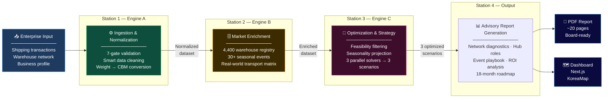

# LogiHub — Product Flow Diagram

```mermaid
flowchart LR
    classDef input    fill:#1e3a5f,stroke:#4a9ede,color:#fff
    classDef engineA  fill:#0d4f3c,stroke:#27ae60,color:#fff
    classDef engineB  fill:#3d2b00,stroke:#f39c12,color:#fff
    classDef engineC  fill:#3d0d2b,stroke:#e91e8c,color:#fff
    classDef output   fill:#0a0a3e,stroke:#3498db,color:#fff

    INPUT["📥 Enterprise Input\n──────────────\nShipping transactions\nWarehouse network\nBusiness profile"]

    subgraph STATION1["Station 1 — Engine A"]
        A["⚙️ Ingestion & Normalization\n──────────────\n7-gate validation\nSmart data cleaning\nWeight → CBM conversion"]
    end

    subgraph STATION2["Station 2 — Engine B"]
        B["🗄️ Market Enrichment\n──────────────\n4,400 warehouse registry\n30+ seasonal events\nReal-world transport matrix"]
    end

    subgraph STATION3["Station 3 — Engine C"]
        C["🧠 Optimization & Strategy\n──────────────\nFeasibility filtering\nSeasonality projection\n3 parallel solvers → 3 scenarios"]
    end

    subgraph STATION4["Station 4 — Output"]
        D["📊 Advisory Report Generation\n──────────────\nNetwork diagnostics · Hub roles\nEvent playbook · ROI analysis\n18-month roadmap"]
    end

    O1["📄 PDF Report\n~20 pages\nBoard-ready"]
    O2["🗺️ Dashboard\nNext.js\nKoreaMap"]

    INPUT --> A
    A -->|"Normalized\ndataset"| B
    B -->|"Enriched\ndataset"| C
    C -->|"3 optimized\nscenarios"| D
    D --> O1
    D --> O2

    class INPUT input
    class A engineA
    class B engineB
    class C engineC
    class O1,O2 output
```

> **End-to-end processing time: 5–15 minutes** from file upload to board-ready advisory report.
